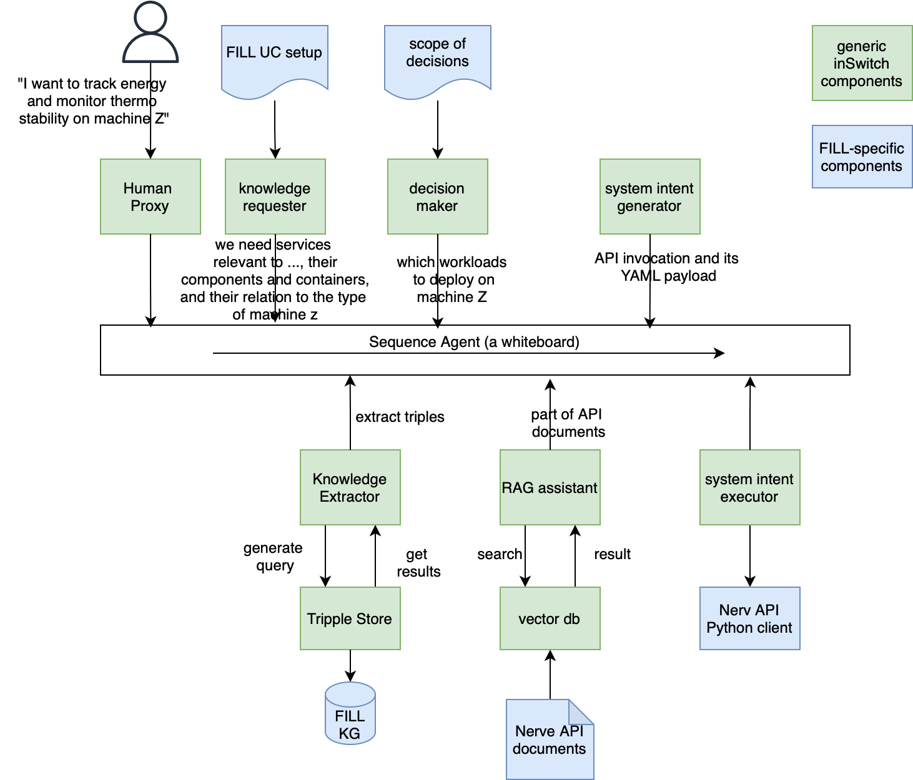
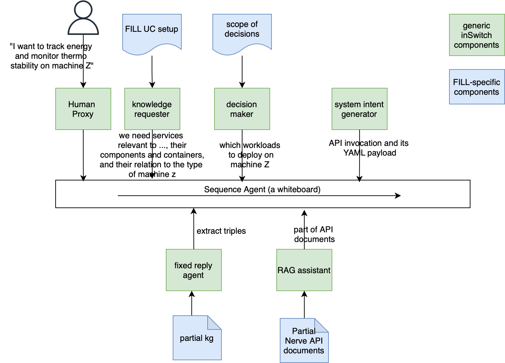

# inSwitch on the FILL use case.

# First milestone: generate Nerve API invocations to deploy workloads

## Target architecture


## Simplified architecture, as the first step


# Progress

## Step 1:
We have the very first step to translate a technical intent into a Nerve API invocation.
*From intent*:
```My intent is to deploy three docker workloads named "ngix" (version 1.27), "neo4j" (version 4.4) and "machine_monitor" (version "1.0") into the machine with serial number M00002.```
*To API invocation*:
``` >>>>>>>> EXECUTING FUNCTION make_request...
PUT: /nerve/dna/M00002/target:
schema_version: 1
workloads:
  - name: ngix
    version: 1.27
  - name: neo4j
    version: 4.4
  - name: machine_monitor
    version: 1.0
```

A execution snapshot can be found [here](doc/snapshots/Step1-simplied-doc-api-call-2024-11-15.ipynb).

# Step 2:
Slightly more abstract intent:

```I am Customer1. 
I want to add a new service to my machine to record all the alarms```

Same output as Step 1.

Snapshot [here](doc/snapshots/Step2-simplified-knowledge-dock-api-call-24-11-17.ipynb)

# Todo list:


